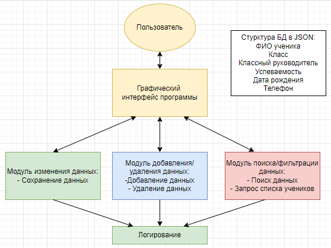
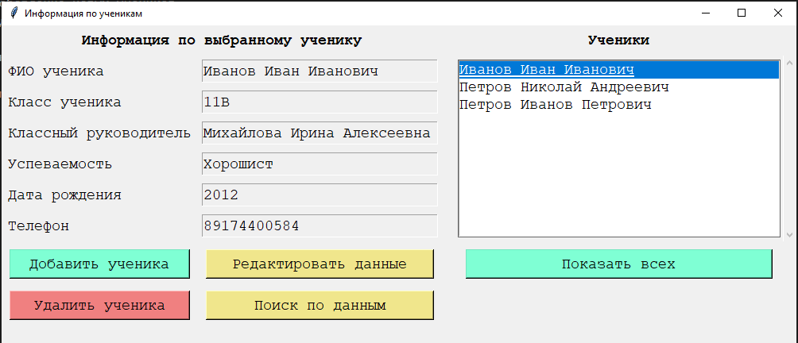

# Разработчики
### Санников Александр
    
        Разработка графического интерфейса

### Крутов Влад

        Разработка модуля добавления и удаления учеников
### Малетин Василий

        Разработка модуля сохранения данных и модуля логирования
### Кремешный Роман

        Разработка модуля поиска и фильтрации данных по ученикам

# Структура программы

Пользователь взаимодействует с интерфейсом программы, который в свою очередь в зависимости от того, какие кнопки нажимаются, передает обработку в модули:
* Модуль изменения данных по ученикам
* Модуль добавления и удаления учеников
* Модуль поиска и фильтрации данных по ученикам

Все действия пользователя фиксируются в файле-логе

# Интерфейс программы

# Описание работы программы

Информационная система по работе с данными учеников работает через графический интерфейс и позволяет осуществлять следующие функции: 
* Хранение данных по ученикам
* Поиск учеников, удовлетворяющих введенным условиям
* Редактирование данных учеников
* Добавление новых учеников
* Удаление лишних учеников
* Логирование всех действий пользователей

Хранение данных происходит в файле json, который создается и хранится в папке программы.
Логирование действий происходит в файле csv, который создается и хранится в папке программы.

При запуске программы, в правой части окна выводится полный список учеников.

При выборе ученика в правой части программы, в окошки выводится по нему вся имеющаяся информация.

При необходимости изменения информации пользователь может нажать кнопку "Редактировать данные", внести изменения и сохранить их обратно в файл json

При необходимости вывода учеников, которые отвечают каким-то конкретным требованиям (Например, год рождения 2012 или Фамилия содержит Иванов), пользователь может нажать кнопку "Поиск по данным", заполнить искомые данные по ученику и нажать кнопку "Найти". При поиске выведутся только ученики, отвечающие всем полям